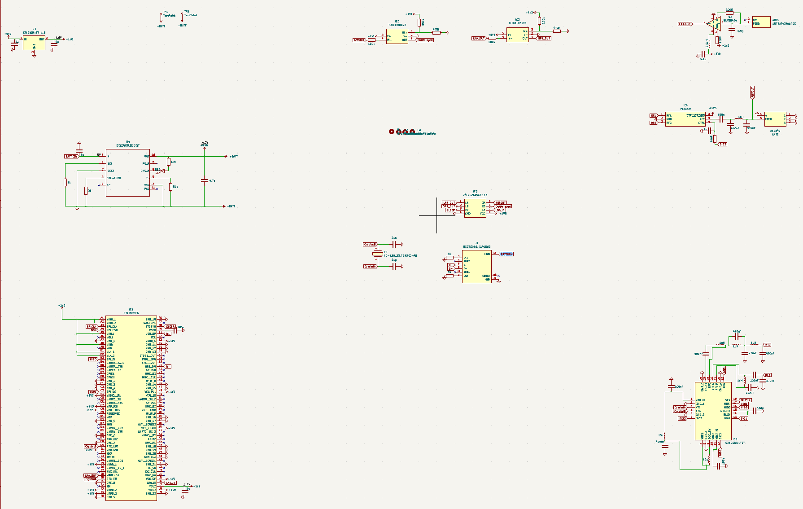
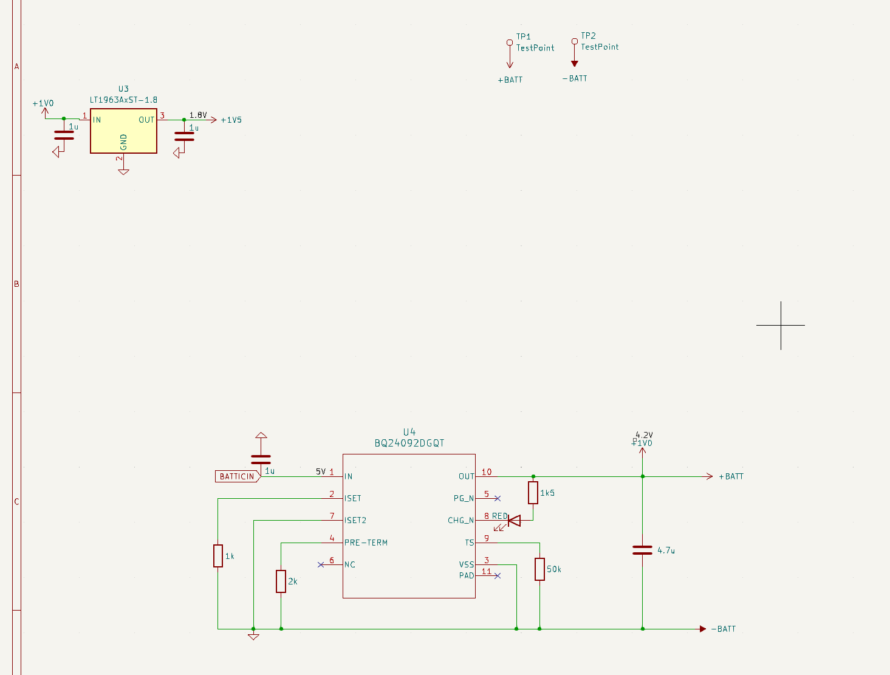
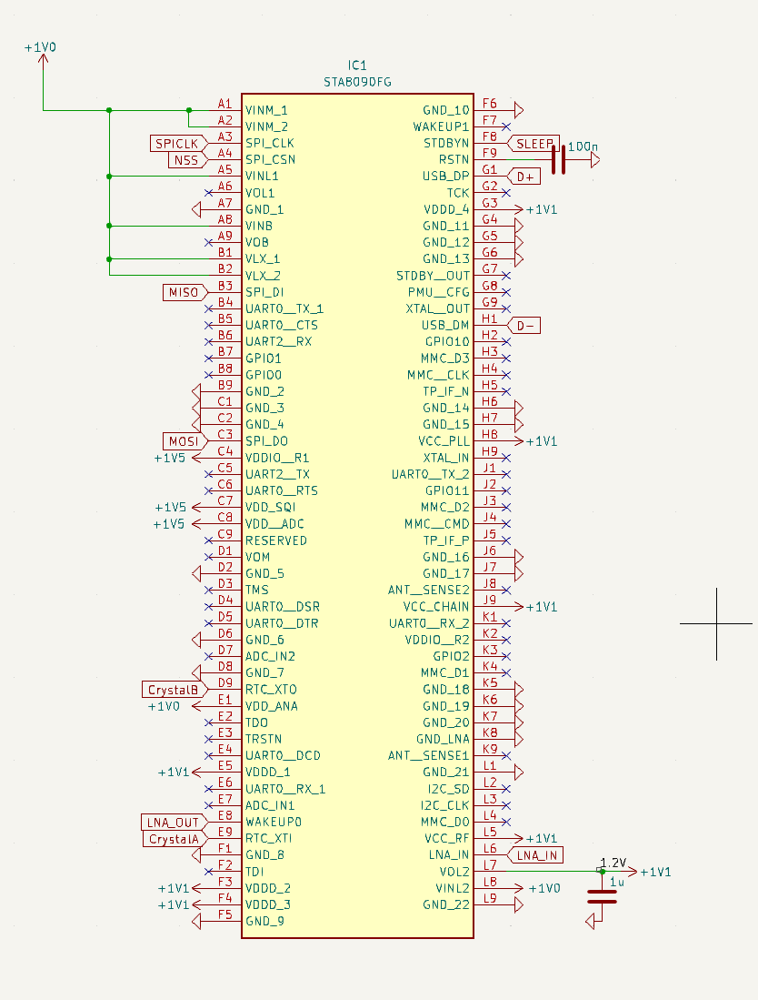
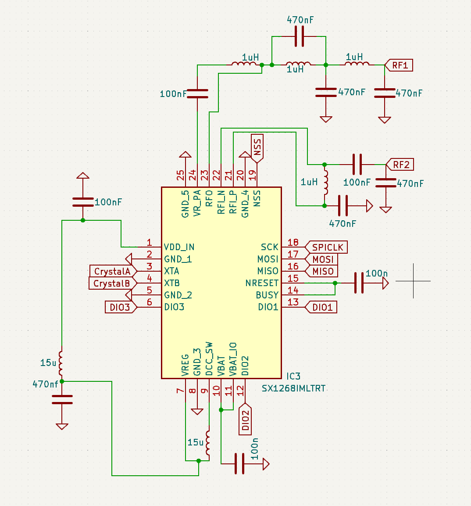
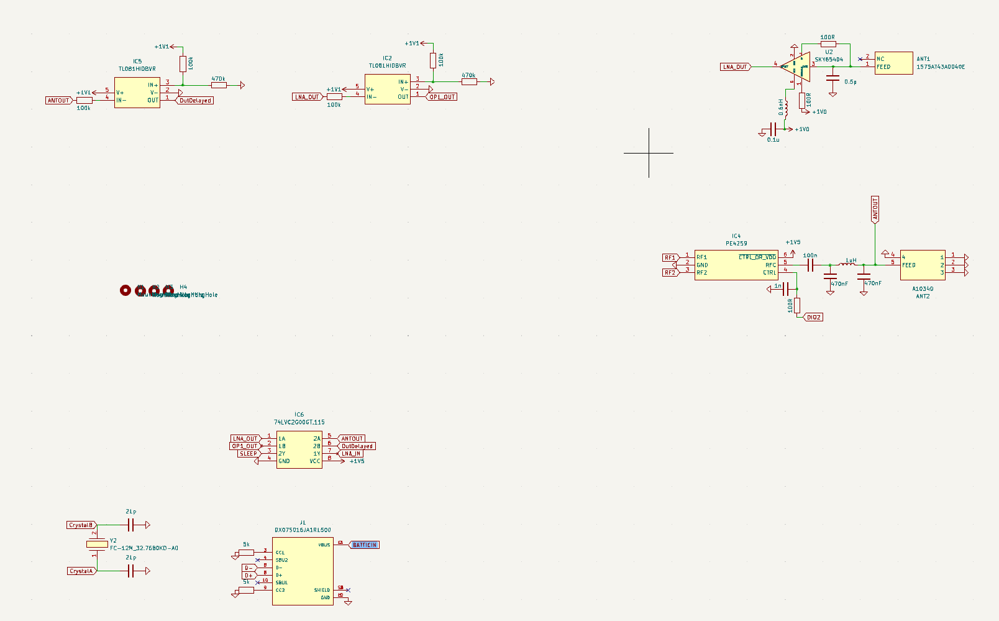
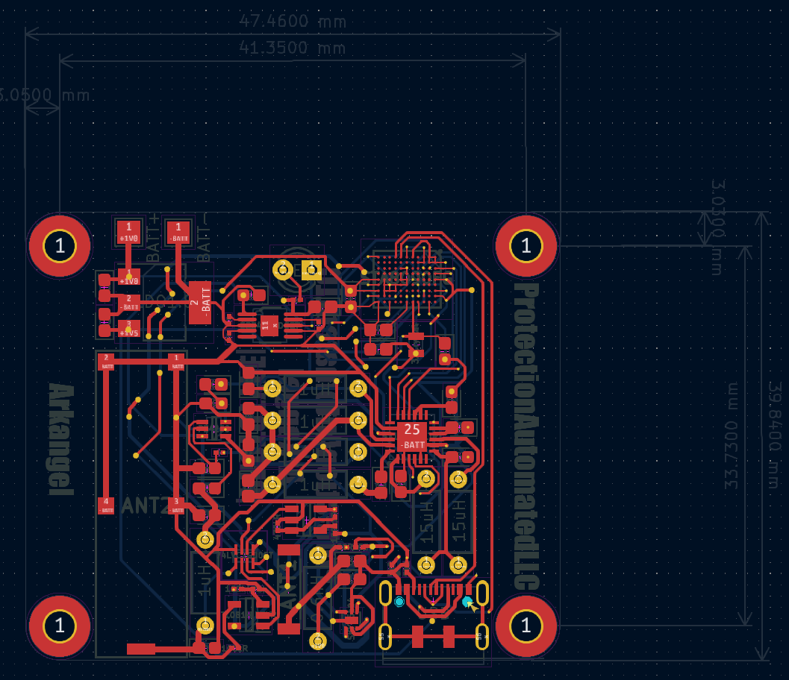

# Kicad Files

## *This folder contains files needed to open / edit this project in KICAD.* 

- I'll use these files to provide screenshots from the IMAGES folder for your entertainment!
- This file could also be considered as a BOM, but i'll leave out component prices as they fluctuate frequently. 
- The PCB should be finished with production within the next week or so (7/27/23), after which I will upload real images of the device.

### **Electrical Schematics** 

#### Complete Schematic

#### LDO and Battery IC
- LDO(1.8V): LT1963A - Linear Technology
-  Rechargable Battert IC: BQ24092 - T.I.

#### Reciever
- RF Reciever: STA8090FG - STM32MicroElectronics
- 

#### Transciever
- RF signal transciever: SX1268IMLTRT - Semtech Corp. 

#### Various Components
- Op-Amp: TL081HIDBVR - T.I.
- LNA: SKY65404-31 - Skyworks
- Input Antenna: 1575AT43A0040001E - Johanson
- SPDT RF Switch: PE4259 - Pasternack
- Output Antenna: A10340 - Antenova
- Dual NAND Gate: 74LVC2G00GT,115 - Nexperia
- Water Resistant USBC Port: DX07S016JA1R1500 - JAE Elec. 
- 32 MHZ Crystal: FC-12M 32.7680KD-A0 - EPSON

### **PCB Schematics**
- I will only show a screenshot of the Front Copper layer, as all of the components are located on this layer. 
- If interested, I welcome a detailed review of the PCB design through the direct file found in this folder. 
- DISCLAIMER: I AM NOT EMPLOYED BY PROTECTION AUTOMATED. I am interested in entrepreneurship in the future. 
If testing proves that a version of this product could become viable, I wanted to label the project as that businesses prototype. 

- A 3D view for a more clear image. 

